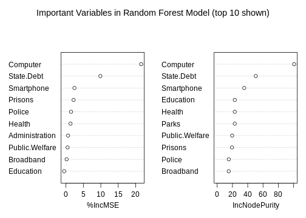
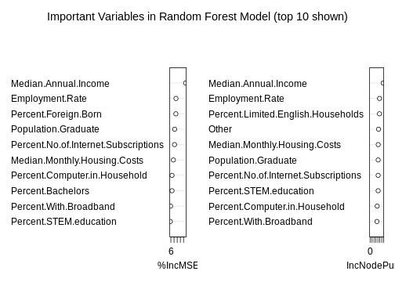

The Correlation between Poverty and Various Internet Infrastructure Indicators

========================================================
author: Team 2, School of Professional Studies, CUNY
class: Data 608
date: 5/24/2019
autosize: true

**Question 1:** What economic indicators (race, occupation, community poverty rate) are most strongly correlated with internet access rates? 

**Question 2:** Can we build a model that accurately predicts said rates?

**Question 3:** Are internet access rates a stronger predictor of poverty rates than other forms of social investment (ie roads, schools, hospitals)?

**Question 4:** Do these effects extend across internet technologies(cell phones and broadband internet)? If not, which type of infrastructure investment is better.

Overview
========================================================

- Motivation, Literature Review, Methodology, and Hypothesis 

- Correlation between Various Technology Indicators and Poverty Rates

- Data Initialization, Plots, and Models (SVM, Neural Networks, and GLM)
 
- Finance Analysis

- Conclusion and Next Steps

Motivation
========================================================

- Our goal is to understand the relationship between internet access and inequality on a global scale
- We will also examine the relationship using American Census Data
- We will use data from the United Nations to compare selected socio-economic indexes to international communication measurements.
- Internet access is a mixed bag
- Internet can benefit politicians, used to spread hate, and intrude on our privacy
- On other hand, Internet can advance economies, and these who do not utilize it seem to fall behind economically

Literature Review
========================================================
- Almost every study, despite the methodology and whether it was cross-country or single country, found a positive economic impact from fixed broadband 
- Using Ordinary Least Square model and data from 1998-2002 the study shows that the availability of broadband services adds as much as 1.4% to the employment growth regardless of actual adoption" (H. Galperin, 2006)
- One study found that of all ICTs (i.e., fixed telephones, mobile, Internet use and broadband), broadband has the biggest economic impact (Qiang et al., 2009)
- However another study found that in a low-income economy, mobile has a bigger impact, both in terms of basic subscriptions and mobile broadband (Katz and Koutroumpis, 2012)
- One of the studies found that mobile broadband actually has a negative impact possibly due to its complementary effect and non-productive application (Thompson and Garbacz, 2011) 
- One study showed that broadband availability has a positive impact on the country employment rate (H. Galperin, 2017)

Sources
========================================================

[American Community Survey](https://www.census.gov/data/developers/data-sets/acs-1year.html) 

[Annual Survey of State Finances](https://www.census.gov/programs-surveys/state.html)

[World Bank Data](https://data.worldbank.org/indicator)

[IEE MAC Address Blocks](http://standards-oui.ieee.org/oui.txt)

[This list of Internet Exchange Points](https://en.wikipedia.org/wiki/List_of_Internet_exchange_points#Active_internet_exchanges)

Methodology
========================================================
- We will use chloropleth maps to show us effect of different variables
- We will build a support vector machine, a neural net, a random forest regressor, and the generalized linear models to see how internet access and infrastructure investment influence poverty rates
- The ACS includes internet access rates, poverty, race, industry, language, occupation, place of birth, and familial origin which should help us to determine if race or occupation is a better indicator of aggregate poverty than internet access rates
- Financial data will help us to investigate if state spending on infrastructure affects poverty more or less than technological infrastructure

Hypothesis
========================================================
- Pew Research says that 20% of teens are unable to finish their homework due to the digital divide. The end result of this is likely low-skill careers and lower incomes.
- In fact, the internet tends to raise the tide for all, as a breadth study (also by Pew) showed that per capita income and access rates are highly correlated. 
- We'd like to investigate the relationship between technology and the economy and see if we can build models resilient to the particle type of device. 
- Due to the multiplicative of effects in education, business opportunities, and spending opportunities available on the Internet, we suspect that governmental investment in digital infrastructure will have at least as much affect as road or school spending. 
-  This research will reveal to governments (both local and national) what kinds of infrastructure investment yields the most economic gains in the digital age. To our knowledge, this particular question has not been answered.

 Data Initialization and Preprocessing 
========================================================
1. Fixing Missing Data: To fill in any missing values, the empty fields were replaced with the mean of the column in which they come from. 
2. Evaluation of metrics:
   a. Data was scaled and centered
   b. Missing data was imputed
3. Correlation of data: We addressed issue of multicollinearity, which improved a fit of our models.
4. Data Pre-processing: Near-zero predictors were removed; Missing values were imputed; We applied Yeo-Johnson transformation method to our predictor variables

 Support Vector Machine 
========================================================

- Comparing SVM with Neural Networks (NN), both are non-linear algorithms
- A Support Vector Machine with different kernels is comparable to a Neural Network with different layers
- The support vector machine performed decently well, but since it optimizes for two introduced variables, it does little to help us explain poverty rates. 
- Support vector machines are used for reducing dimensionality, not for examining the data in place. 
- So, it is inappropriate for our purposes, even if it is relatively accurate

|Model                  | RMSE.train| RSquared.train| RMSE.test| RSquared.test|
|:----------------------|----------:|--------------:|---------:|-------------:|
|Support Vector Machine |     2.8493|      0.8711891|    1.5309|     0.5936714|

Generalized Linear Model
========================================================

- The variable importance plot is composed of two subplots. 
- The left one indicates the mean square error introduced by excluding a given variable and is a measure of an indicator's relevance.
- The right one indicates the nodes that allow for the fewest number of decision splits in our model and are very similar to the linear model below, likely due to our minimization of model complexity (as measured by AIC). 
- The random forest regressor works by using automation and sampling to make many regression models before investigating the resulting output relative to the sensitivity and precision of the input. 

===================================================

Variable Importance Plot for Social Indicators

 Conclusion - Social Indicators   
========================================================

==============================================

- We were successfully able to evaluate the efficacy of several different models.

- The non-parametric models did not perform as well as the parametric one, perhaps because we had reduced our dimensionality during pre-processing.
- Additionally, they both suffer from large test/train splits. 

- The linear model performed very well, but the strongest indicators were raced based - seeming to an indicate geography as a confounding factor. -

- The random forest method performed only slightly worse than the generalized linear model, but due to the iterative nature of the algorithm,it had a superior test/train split indicating more generalizability  

- Because the glm and random forest have human-readable coefficients/factors and performed the best, we will continue using them moving forward.

Finance Analysis
========================================================
- The American Community Survey also collects data from state governments about their spending habits. 
- First, we use the random forest model because the variable importance that it measures will inform our linear model below. As above, this model works by alliteratively building regression models and measuring the resulting change to the response variable.
- The most important variables on the financial data set are computer, smartphone, and state debt. That is true for both precision and accuracy. 
- Notably, the computer indicator is a better indicator of poverty status than broadband access, suggesting that the ability to learn and create technology is far more valuable than mere access. 

Financial Indicators
===========================================================

Conclusion
========================================================
- Across the board, our models seem to indicate that having a laptop or desktop computer is a far more valuable indicator of poverty rate than smart phone or broadband subscription rates.
- While the social models are dominated by racial considerations, the positive value of all racial coefficients seems to favor diversity over a given race. Additionally, this indicates that geography is a confounding factor in these models as the wealthiest states have the most immigration and the most diverse populations.
- When it comes to the economic models, technological access is a much strong indicator of poverty rates than state spending on education, schools or police. 
- Since our models are not totally consistent, it's impossible to draw a strong conclusion about correlation or causality. 
- However, it's clear that technological access is important to a healthy economy and a reduction of poverty rates. 
- Luckily, there are ways to measure these things more directly. Unfortunately, they are outside the scope of this investigation.

Next Steps
========================================================
- There are many ways we can continue improving the model performance, one method could be running more times of cross validation on more folds than 10 times
- 10-fold we have now for SVM  
- It would take a longer time to compute, but the results would likely be better. 
- Finally, more data would help us build a better model, in particular because the gap between the test and train sets tends to be relatively large across all of the models, with the exception of the Random Forest regressor because it builds its model over 1000 iterations. 
- We could also use time-series data to examine causal relationships between the data using either Bayesian networks or Granger inference. 
- The former requires a much larger amount of data (perhaps all county level census data since 2010) and the Granger analysis requires continuous time-series data. 

